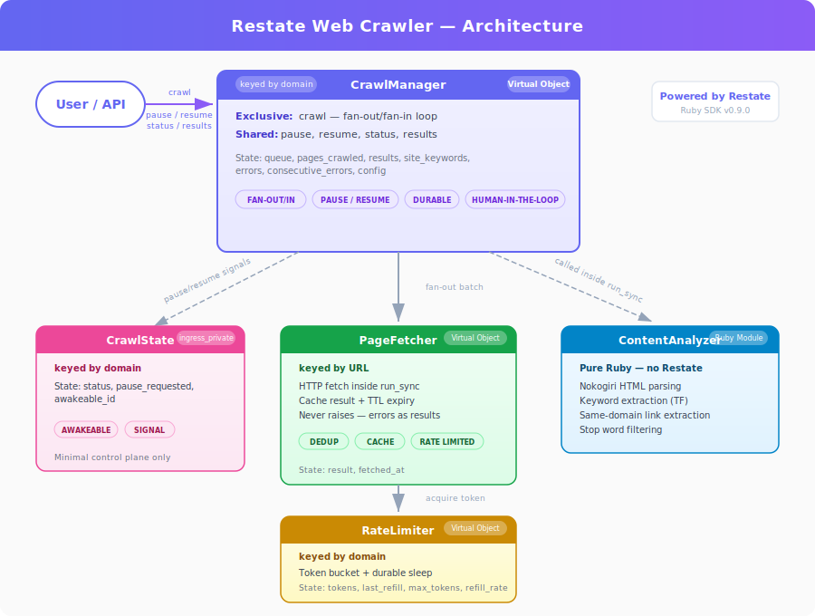

# Restate Web Crawler

A web crawler built on [Restate](https://restate.dev) using the [Ruby SDK](https://github.com/restatedev/sdk-ruby). Demonstrates how Restate's durable execution primitives solve common distributed systems challenges in web crawling: rate limiting, pause/resume, human-in-the-loop intervention, deduplication, and parallel processing.

## Architecture



### Components

| Component | Type | Key | Purpose |
|-----------|------|-----|---------|
| **CrawlManager** | Virtual Object | domain | Public API + crawl loop orchestrator |
| **CrawlState** | Virtual Object | domain | Minimal control-plane state (pause/resume signaling) |
| **PageFetcher** | Virtual Object | URL | Per-page fetch with built-in dedup and TTL cache |
| **RateLimiter** | Virtual Object | domain | Token bucket rate limiter with durable sleep |
| **ContentAnalyzer** | Ruby module | — | HTML parsing, link extraction, keyword analysis |

## Restate Patterns Demonstrated

### 1. Fan-out / Fan-in
Pages are fetched in parallel batches. The crawl manager dispatches multiple `PageFetcher` calls simultaneously and awaits all results before processing the next batch.

### 2. Rate Limiting
A virtual object per domain implements a token bucket. Since the `acquire` handler is exclusive, concurrent fetch requests naturally queue up and are spaced out using durable sleep — no tokens wasted, no threads blocked.

### 3. Pause / Resume
The crawl loop can be paused externally via API (or from the Restate UI by cancelling). Pause uses an **awakeable** — a durable callback token. The crawl suspends at the awakeable, consuming no resources. A `resume` call resolves the awakeable, and the crawl continues exactly where it left off — even across process restarts.

### 4. Human-in-the-Loop
When the crawler hits too many consecutive errors (e.g., a firewall blocking requests), it automatically pauses and logs a message asking for human intervention. The human investigates, fixes the issue, and calls the resume endpoint. Same awakeable mechanism as manual pause.

### 5. Deduplication
Each `PageFetcher` is a virtual object keyed by URL. The first fetch stores the processed result in state. Subsequent calls for the same URL return the cached result immediately. Cache expires after a configurable TTL so pages can eventually be re-crawled.

### 6. Durable Execution
Every HTTP fetch is wrapped in `Restate.run_sync` — a durable side effect. If the process crashes mid-crawl, Restate replays the journal: already-completed fetches are skipped (results replayed from the journal), and the crawl resumes from the exact point of failure.

## Prerequisites

- **Ruby** >= 3.1
- **Restate Server** ([install guide](https://docs.restate.dev/develop/local_dev))
- **Bundler**

## Quick Start

```bash
# Install dependencies
bundle install
```

## Demo Walkthrough

You'll need three terminals, all in the project directory.

### Setup

**Terminal 1 — Restate server:**
```bash
restate-server
```

**Terminal 2 — Crawler service:**
```bash
bundle exec falcon serve --bind http://localhost:9080
```

**Terminal 3 — Commands:**
```bash
restate deployments register http://localhost:9080
```

### 1. Start a Crawl

```bash
curl -X POST localhost:8080/CrawlManager/restate.dev/crawl/send \
  -H 'content-type: application/json' \
  -d '{
    "seed_url": "https://restate.dev",
    "max_pages": 50,
    "batch_size": 5
  }'
```

The `/send` suffix makes it fire-and-forget — the call returns immediately while the crawl runs in the background. Watch Terminal 2 for log output as pages are fetched.

### 2. Monitor Progress

Run this a few times to watch the crawl in real time:

```bash
curl -s localhost:8080/CrawlManager/restate.dev/status \
  -H 'content-type: application/json' -d 'null' | python3 -m json.tool
```

You'll see `pages_crawled` increasing and `queue_size` growing as new links are discovered.

### 3. View Results (while crawling)

You can query results at any time — even while the crawl is running. The `results` handler is a shared handler that reads state concurrently:

```bash
./results.sh restate.dev
```

Run it multiple times to see keywords accumulating live.

### 4. Pause

Pause the crawl while it's running:

```bash
curl -s -X POST localhost:8080/CrawlManager/restate.dev/pause \
  -H 'content-type: application/json' -d 'null' | python3 -m json.tool
```

Check status to confirm `"status": "paused"`. The crawl is suspended on an awakeable, consuming no resources.

### 5. Resume

```bash
curl -s -X POST localhost:8080/CrawlManager/restate.dev/resume \
  -H 'content-type: application/json' -d 'null' | python3 -m json.tool
```

The crawl continues exactly where it left off — even if the service was restarted while paused.

### 6. View Results

You can view results at any time — even while the crawl is running. Use the included script:

```bash
./results.sh restate.dev
```

This shows a formatted report with crawl status, top keywords with frequency bars, page titles with word counts, and any errors.

### 7. Cancel

Cancel a crawl from the Restate UI at http://localhost:9070 — find the `CrawlManager/crawl` invocation and cancel it. Or via CLI:

```bash
restate invocations list
restate invocations cancel <invocation_id>
```

## Human-in-the-Loop (Simulated Errors)

To demo the automatic error-pause flow, use `simulate_errors_after`. This makes the crawler return simulated 403 firewall errors after N successful pages:

```bash
curl -X POST localhost:8080/CrawlManager/restate.dev/crawl/send \
  -H 'content-type: application/json' \
  -d '{
    "seed_url": "https://restate.dev",
    "max_pages": 30,
    "batch_size": 5,
    "simulate_errors_after": 15
  }'
```

After 15 pages, the simulated errors begin. After 5 consecutive errors, the crawler **auto-pauses** and logs to Terminal 2:

```
[CrawlManager] HUMAN INTERVENTION NEEDED — call POST /CrawlManager/restate.dev/resume to continue
```

Status will show `"status": "error_paused"`. The crawl is suspended on an awakeable — no resources consumed, survives restarts. Resume with:

```bash
curl -s -X POST localhost:8080/CrawlManager/restate.dev/resume \
  -H 'content-type: application/json' -d 'null'
```

## Configuration

| Parameter | Default | Description |
|-----------|---------|-------------|
| `seed_url` | *(required)* | Starting URL for the crawl |
| `max_pages` | 50 | Maximum pages to crawl |
| `batch_size` | 5 | Pages fetched in parallel per batch |
| `simulate_errors_after` | *(disabled)* | Start returning 403 errors after N pages |
| `cache_ttl` | 86400 (24h) | Seconds before a cached page result expires |

Rate limiter defaults: 5 token bucket capacity, 2 tokens/second refill rate. Configure via:

```bash
curl -X POST localhost:8080/RateLimiter/restate.dev/configure \
  -H 'content-type: application/json' \
  -d '{"max_tokens": 10, "refill_rate": 5.0}'
```

## Admin

- **Restate UI**: http://localhost:9070 — inspect virtual object state, view invocations, cancel crawls
- **Cancel a crawl**: Cancel the `CrawlManager/{domain}/crawl` invocation from the UI
- **Restate CLI**: `restate invocations list` to see active crawls
